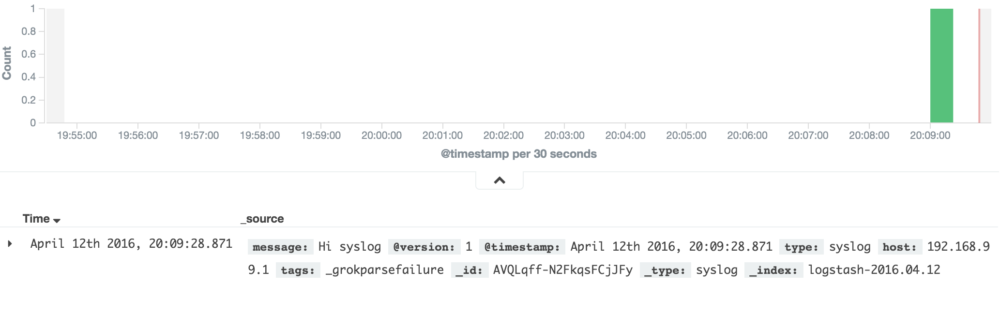

#ELK
A compose file to setup and ELK stack.

Logstash will be listening for syslog events on the UDP port 5000.

Clone the repo with:

    $ git clone git@github.com:MBuffenoir/elk.git
    $ cd elk

Create a local machine and start ELK with:

    $ docker-machine create -d virtualbox elk
    $ docker-machine scp -r conf-files/ elk:
    $ eval $(docker-machine env elk)
    $ docker-compose up -d

Test it with a simple command:

    $ nc -w0 -u $(docker-machine ip elk) 5000 <<< "Hi syslog"

#On a cloud machine

Running the compose file on a distant machine will require a copy of the `conf-files` folder on it.
You can use docker-machine for this purpose:

    $ docker-machine scp -r conf-files machine_name:

The file `docker-compose-ubuntu.yml` is an example to be used with an ubuntu machine:

    $ docker-machine -f docker-compose-ubuntu.yml up -d

This compose file should also work without issue on a swarm cluster.

#Create you first index

Once your first data has been sent to logstash, it is then possible to create your first index by logging into kibana.

Navigate to `https://$(docker-machine ip elk):5600`.

The login is `admin` and the password is `Kibana05` (see the comments at the top of the file `/conf-files/proxy-conf/kibana-nginx.conf` to change those credentials).

Click on the `Create` button to create your first index.

Click on the Discover tab, you should now get access to your logs:

